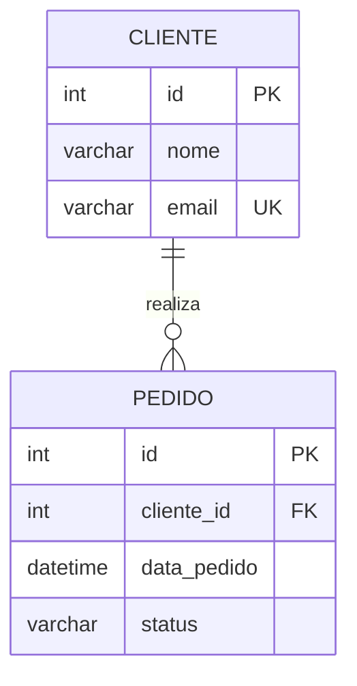

# Padrões de Documentação SQL Server

## Estrutura de Documentação de Procedure

Todo documento de stored procedure deve seguir esta ordem:

1. **Cabeçalho** — Nome completo `[schema].[nome]`, tipo, datas
2. **Resumo Executivo** — 2-3 linhas de propósito de negócio
3. **Parâmetros** — Tabela com nome, tipo, direção, obrigatoriedade e descrição
4. **Fluxo de Execução** — Diagrama Mermaid + descrição textual
5. **Regras de Negócio** — Lista numerada (RN001, RN002…)
6. **Tabelas Acessadas** — Com tipo de operação (R/W)
7. **Tratamento de Erros** — Cenários e comportamentos
8. **Dependências Diretas** — O que esta procedure usa
9. **Dependências Reversas** — Quem usa esta procedure
10. **Issues / Anti-Patterns** — Problemas identificados com severidade
11. **Sugestões de Melhoria** (opcional)

## Convenções de Nomenclatura na Documentação

- Referencie objetos SQL sempre com backticks e schema: `` `dbo.Pedidos` ``
- Use **negrito** para termos de negócio importantes
- Use `código inline` para nomes de colunas, parâmetros e valores
- Use ⚠️ para alertas e bugs
- Use ✅ para boas práticas identificadas

## Regras de Negócio — Formato

```
**RN001** — <Verbo no imperativo> <sujeito> <condição>
Origem: `[schema].[procedure]` linha ~XX / CHECK CONSTRAINT `ck_nome`
```

Exemplo:
```
**RN001** — Pedidos só podem ser cancelados se o Status for 'Pendente' ou 'Processando'.
Origem: `dbo.sp_CancelarPedido` — condicional `IF @Status NOT IN ('Pendente','Processando')`
```

## Diagramas ER em Mermaid

Para documentação de módulos ou domínios:



## Nível de Detalhe

- **Análise rápida**: Resumo + Parâmetros + Regras de Negócio principais
- **Documentação completa**: Todos os 11 itens do template
- **Auditoria técnica**: Documentação completa + seção de vulnerabilidades e anti-patterns detalhados
