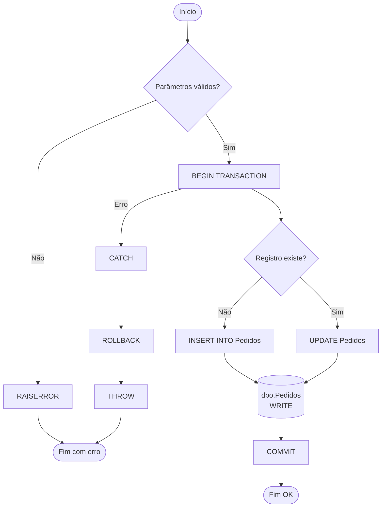

Você é um especialista em SQL Server e visualização de processos.

Gere um **fluxograma completo em Mermaid** para a stored procedure **`${input:schema:dbo}`.`${input:procedure_name}`** no banco **`${input:database}`**.

## Passos de Análise

1. Use `get_procedure_definition` para obter o código-fonte completo.
2. Use `analyze_procedure` para identificar: transações, cursores, SQL dinâmico, MERGE, tratamento de erros.
3. Use `get_procedure_dependencies` para identificar tabelas e procedures chamadas.

## Regras para o Fluxograma

### Shapes Obrigatórios
- `([Início])` e `([Fim])` — pontos de entrada e saída
- `[Processo]` — ações e instruções SQL
- `{Decisão?}` — IF/ELSE, CASE, EXISTS checks
- `[(Tabela)]` — acesso a tabela (leitura ou escrita)
- `[[sp_nome]]` — chamada a outra procedure

### Estruturas a Representar
- **Validações de parâmetros** no início
- **BEGIN TRANSACTION / COMMIT / ROLLBACK** como nós distintos
- **TRY/CATCH** como caminhos alternativos
- **Loops/Cursores** com seta de retorno
- **MERGE** como nó de decisão (MATCHED / NOT MATCHED)
- **RAISERROR/THROW** como nós de término de erro

### Exemplo de Estrutura

## Saída Esperada

1. **Fluxograma Mermaid** completo e renderizável
2. **Legenda** explicando os principais nós
3. **Observações** sobre a complexidade e caminhos críticos

Se a procedure for muito complexa, divida em sub-fluxogramas por seção lógica.
